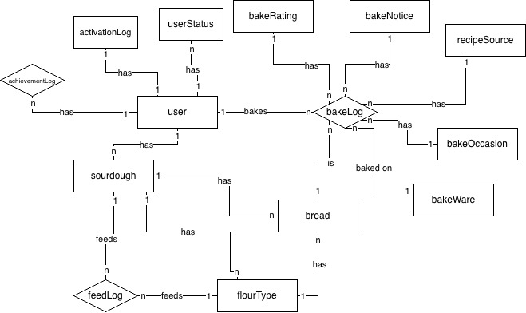
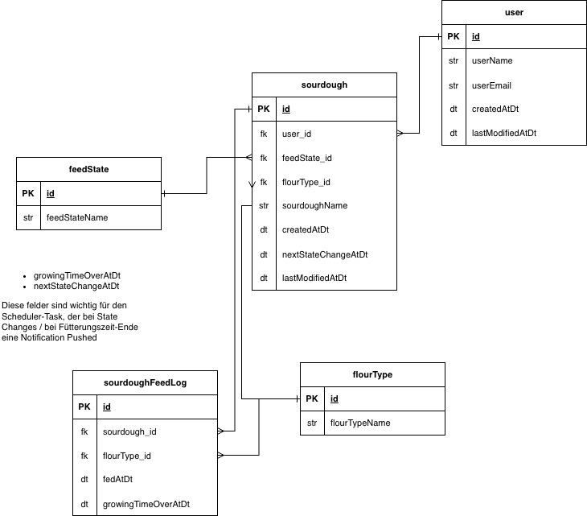

# Hard Facts
- **Working Title:** Sour-Otchi

# Vision
> My sourdough not only lives in the **fridge**, but also on my **phone**

# Kern
Sotchi hilft Nutzern dabei, ihren lebenden oder gerade entstehenden Sauerteig-Starter am Leben zu erhalten. Die daraus entstehenden Meisterwerke können verewigt & geteilt werden.

# Entity Relationship Diagram

# Relational Model

## Features (MVP)
- User können einen / mehrere Sauerteige anlegen (Profil) und customizen
- User können eine Bake-History anlegen und die gebackenen Brote mit den verwendeten Sauerteigen verknüpfen
- Gamification > der Sauerteig als virtuelles Haustier
- User werden benachrichtigt bei wichtigen Sauerteig-bezogenen Events

## Gamification - Sauerteig als virtuelles Haustier
### Echtzeit Mechanik
- Der Starter hat einen "Hunger Countdown" > Abhängigkeit von Lagerung (Kühlschrank / Raumtemperatur)
- Timer läuft real mit

Dadurch können sich diverse Zustandsanzeigen in der App ergeben:
- Fit & aktiv
- Hungrig
- Schwach
- Übersäuert
- Tot

### Füttern als Kernmechanik
- In der App auf "gefüttert" klicken
- Eingabe von Fütterungswerten:
    - Verhältnis Wasser / Mehl
    - Mehlsorte
    - Temperatur

**In der App**
- Entwicklung wird simuliert (Dein Sauerteig könnte fertig gefüttert sein)
- Gibt Feedback je nach Mehl ("Wow, ich liebe Roggen!")

### Entwicklungsstufen / Progression
Jedes gebackene Brot ist eine neue Entwicklungsstufe.

### Persönlichkeit & Bindung
Der Sauerteig erhält über das Profil folgende Themen:
- Name
- Avatar
- Aufbewahrungsbehältnis
- Mehltyp / Sorte
- Alter

Mit der Zeit können dann auch noch eigene Charakterzüge hinzukommen, wie z.B.:
- Temperamentvoll
- Leicht säuerlich
- Träge im Winter

### Konsequenzen
Der Sauerteig durchläuft je nach Fütterungskonsistenz verschiedene Zustände, z.B.:
- Phase 1: "Mir geht es nicht so gut..."
- Phase 2: "Ich fühle mich schwach..."
- Phase 3: "Ich glaube, ich kippe gleich..."
- Phase 4: App schlägt Rettungsplan vor ("Handle jetzt und füttere, sonst wird er ggfs. sterben)

### Achievement-System
> Ausbaustufe: Wichtig hier dann aber mit Social-Share-Möglichkeit
- 7 Tage am Stück gefüttert
- 30 Tage ohne Tod
- 5 Brote gebacken
- Winter überlebt
- 3 Mehlsorten getestet

---
### Bake-History Features
> Brot-Tagebuch
- Hinterlegung von Informationen
    - Wurde gebacken auf Stein, im Römertopf, im Gusseisen Topf,...
    - Taste Rating
    - Individuelle Notizen
    - Verwendeter Sauerteig
    - Verwendete Mehlsorten / Typen / Marken
    - Quelle des Rezepts (z.B. Buch XYZ Seite 3.) -> Ziel: Nach 3 Jahren reinschauen und genau wissen: Das will ich backen, hier finde ich das Rezept
    - Anlass des Backens (Geburtstag, täglicher Gebrauch,...)
- Teilen auf Social Media
- Filterung nach Kategorien (zeige mir meine Rezepte nur nach Mehlsorte)

### Notification Feature
- Sauerteig muss gefüttert werden
- Auf Basis von Gamification Events
